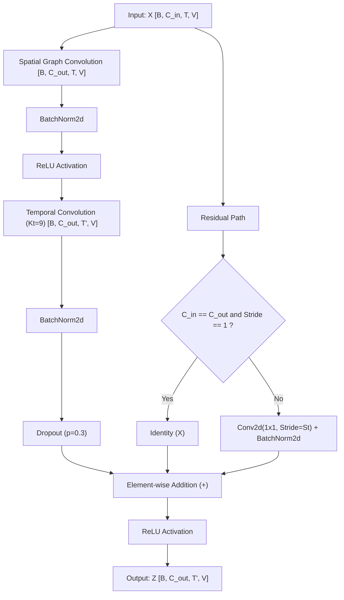

# SignTalk AI — ST-GCN Mathematical Architecture Design

**Document ID:** `DOC-P3P2-MATH-001`  
**Phase:** Phase 3 — Part 2 (ST-GCN Development & Training)  
**Layer References:**
- Spatial Graph Convolution: [`src/models/layers/graph_conv.py`](file:///d:/SignAI/src/models/layers/graph_conv.py)
- Temporal Convolution: [`src/models/layers/temporal_conv.py`](file:///d:/SignAI/src/models/layers/temporal_conv.py)
- ST-GCN Unit Block: [`src/models/layers/stgcn_block.py`](file:///d:/SignAI/src/models/layers/stgcn_block.py)
- Complete Network: [`src/models/stgcn.py`](file:///d:/SignAI/src/models/stgcn.py)  

---

## 1. Input Tensor Tensor Space

The network consumes a 4D continuous spatiotemporal tensor:
$$\mathbf{X} \in \mathbb{R}^{B \times C \times T \times V}$$
where:
- $B$: Batch dimension (e.g. $B=8$).
- $C$: Feature channel dimension ($C_{\text{in}} = 3$ for $[x, y, z]$ Cartesian landmark coordinates).
- $T$: Temporal sequence length ($T = 45$ frames).
- $V$: Anatomical graph node count ($V = 93$ nodes).

---

## 2. Spatial Graph Convolution Layer

The Spatial Graph Convolution layer propagates joint features across localized anatomical bones at each individual time step $t \in \{1, \dots, T\}$.

Given normalized partition adjacency $\mathbf{\hat{A}} \in \mathbb{R}^{K \times V \times V}$ and learnable edge attention mask $\mathbf{M} \in \mathbb{R}^{K \times V \times V}$:
$$\mathbf{A}_k^{\text{eff}} = \mathbf{\hat{A}}_k \odot \mathbf{M}_k \quad \forall k \in \{0, \dots, K-1\}$$

For input $\mathbf{X}_t \in \mathbb{R}^{B \times C_{\text{in}} \times V}$ at time step $t$:
$$\mathbf{Y}_t = \sum_{k=0}^{K-1} \mathbf{W}_k \mathbf{X}_t \left(\mathbf{A}_k^{\text{eff}}\right)^{\top}$$
where $\mathbf{W}_k \in \mathbb{R}^{C_{\text{out}} \times C_{\text{in}}}$ is implemented via a 2D convolution kernel of size $1 \times 1$.

In tensor Einstein notation over the batch:
$$\mathbf{Y}_{b, c_{\text{out}}, t, v} = \sum_{k=0}^{K-1} \sum_{c_{\text{in}}} \sum_{u} \mathbf{W}_{k, c_{\text{out}}, c_{\text{in}}} \mathbf{X}_{b, c_{\text{in}}, t, u} \mathbf{A}_{k, v, u}^{\text{eff}}$$

---

## 3. Temporal Convolution Layer

Once spatial joint configurations have been synthesized across the skeleton, the Temporal Convolution layer models movement dynamics along the temporal axis $T$.

Unlike RNNs that process frames sequentially with recurrent hidden states, the Temporal Convolution uses a 1D convolution kernel operating across temporal slices:
$$\mathbf{Z} = \text{Conv2d}(\mathbf{Y}, \text{kernel\_size}=(K_t, 1), \text{stride}=(S_t, 1), \text{padding}=(P_t, 0))$$

- **Kernel Size ($K_t$):** Standard $K_t = 9$ frames ($\sim 0.36\text{s}$ receptive field per layer).
- **Temporal Stride ($S_t$):** $S_t = 1$ (preserves sequence length $T=45$) or $S_t = 2$ (temporal downsampling).
- **Padding ($P_t$):** $P_t = (K_t - 1) // 2$ ensuring symmetric temporal padding.
- **Node Dimension ($V$):** Convolutions are applied strictly over $T$, treating $V$ independently ($1 \times 1$ spatial stride).

---

## 4. The ST-GCN Unit Block

Each ST-GCN block combines spatial graph convolution, temporal 1D convolution, normalization, non-linear activation, and a residual skip connection:

### Exact Mathematical Pipeline within Block $l$:
1. **Spatial Propagation:**
   $$\mathbf{X}_{\text{spat}} = \text{GraphConv}(\mathbf{X}_{l-1}, \mathbf{A})$$
2. **First Normalization & Non-linearity:**
   $$\mathbf{H}_1 = \text{ReLU}(\text{BatchNorm2d}(\mathbf{X}_{\text{spat}}))$$
3. **Temporal Dynamics:**
   $$\mathbf{X}_{\text{temp}} = \text{TemporalConv}(\mathbf{H}_1)$$
4. **Second Normalization & Regularization:**
   $$\mathbf{H}_2 = \text{Dropout}(\text{BatchNorm2d}(\mathbf{X}_{\text{temp}}))$$
5. **Residual Formulation:**
   $$\mathbf{R} = \begin{cases} \mathbf{X}_{l-1} & \text{if } C_{\text{in}} = C_{\text{out}} \text{ and } S_t = 1 \\ \text{BatchNorm2d}(\text{Conv2d}_{1 \times 1}(\mathbf{X}_{l-1})) & \text{otherwise} \end{cases}$$
6. **Block Output:**
   $$\mathbf{X}_l = \text{ReLU}(\mathbf{H}_2 + \mathbf{R})$$

---

## 5. Complete Network & Classification Head

The complete ST-GCN network stacks multiple blocks with hierarchical channel expansion:
1. **Input Normalization:** `BatchNorm2d` over the input channel coordinates $[B, 3, T, V]$.
2. **ST-GCN Block Stack:**
   - Block 1: $C_{\text{in}} = 3 \to C_{\text{out}} = 64$, temporal stride $1$ ($T=45$).
   - Block 2: $C_{\text{in}} = 64 \to C_{\text{out}} = 64$, temporal stride $1$ ($T=45$).
   - Block 3: $C_{\text{in}} = 64 \to C_{\text{out}} = 128$, temporal stride $2$ ($T=23$).
   - Block 4: $C_{\text{in}} = 128 \to C_{\text{out}} = 128$, temporal stride $1$ ($T=23$).
   - Block 5: $C_{\text{in}} = 128 \to C_{\text{out}} = 256$, temporal stride $2$ ($T=12$).
   - Block 6: $C_{\text{in}} = 256 \to C_{\text{out}} = 256$, temporal stride $1$ ($T=12$).
3. **Global Spatial & Temporal Pooling:**
   Global average pooling over all remaining temporal frames $T'$ and graph nodes $V$:
   $$\mathbf{g} = \frac{1}{T' \cdot V} \sum_{t=1}^{T'} \sum_{v=1}^{V} \mathbf{X}_{6}(:, :, t, v) \in \mathbb{R}^{B \times 256}$$
4. **Classification Head:**
   Linear projection from the global sequence-joint descriptor $\mathbf{g}$ to class logits:
   $$\hat{\mathbf{y}} = \mathbf{W}_{\text{head}} \mathbf{g} + \mathbf{b}_{\text{head}} \in \mathbb{R}^{B \times 10}$$
